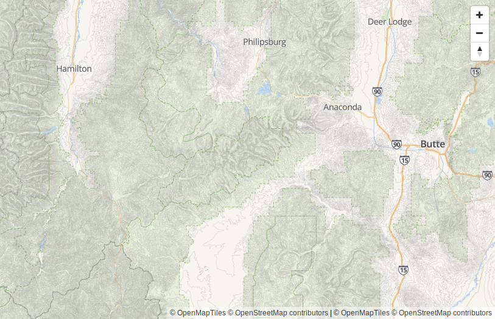
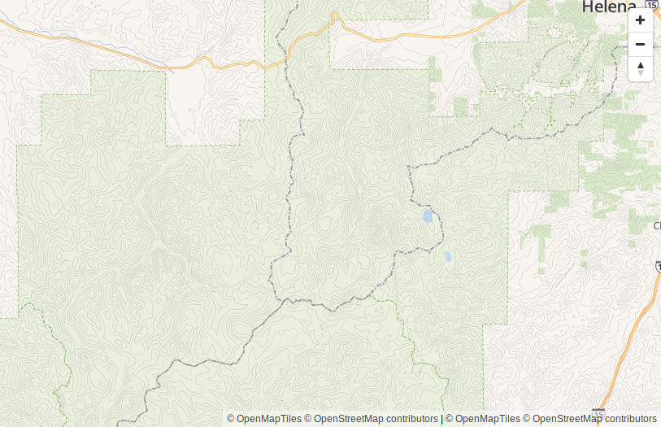
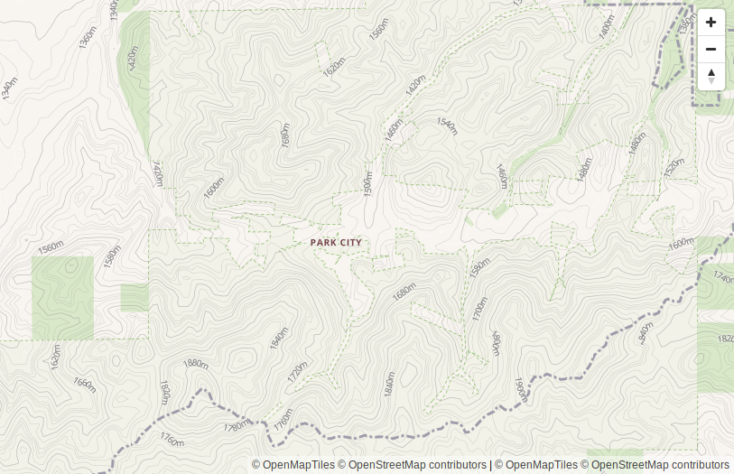
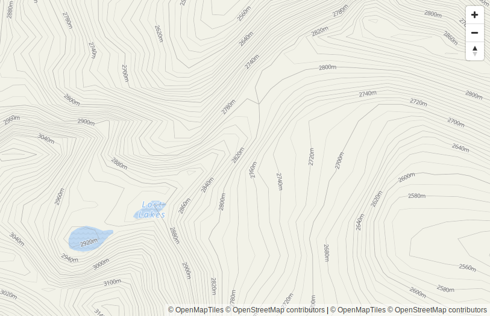

OSM Bright Topo
===============

This is a modified version of the OSM Bright map style with added contour lines.


Preview
-------

**Zoom level 8**


**Zoom level 10**


**Zoom level 12**


**Zoom level 14**


Using
-----

1. Start with an installation of TileServer GL.
2. Using the `config.json` file below as an example, modify your `config.json`.  
   The important detail is that the ID of your "normal" map is "v3" and your  
   contour map is "contour".  Otherwise you'll need to modify `style.json`.
3. Copy this folder into the styles folder defined in your `config.json`.
4. Restart TileServer GL to apply the new configuration.


Sample config.json
------------------

```json
{
  "options": {
    "paths": {
      "root": "/data",
      "fonts": "fonts",
      "styles": "styles",
      "mbtiles": "/data"
    }
  },
  "styles": {
    "osm-bright-topo": {
      "style": "osm-bright-topo/style.json",
      "tilejson": {
        "bounds": [
          -180,
          -85.0511,
          180,
          85.0511
        ]
      }
    }
  },
  "data": {
    "v3": {
      "mbtiles": "osm-2017-07-03-north-america.mbtiles"
    },
    "contour": {
      "mbtiles": "us-west-contour.mbtiles"
    }
  }
}
```
